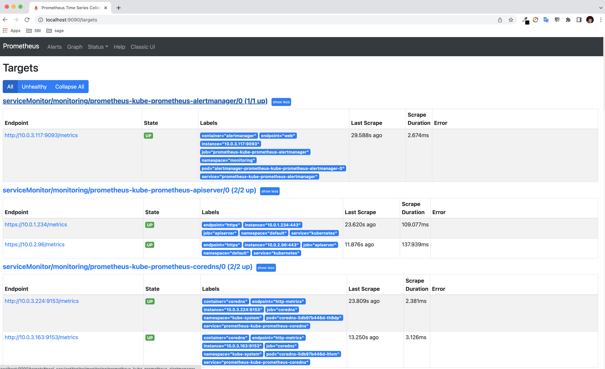

# Terraform to deploy kube-prometheus-stack in AWS EKS using Helm chart

This repository if forked from hashicorp/learn-terraform-provision-eks-cluster and modified to deploy kube-prometheus-stack in EKS using Helm chart.

## Sample output after terraform apply

```bash
 kubectl get pods -n monitoring                                                                                                           false
NAME                                                     READY   STATUS    RESTARTS      AGE
alertmanager-prometheus-kube-prometheus-alertmanager-0   2/2     Running   0             10m
prometheus-grafana-f69f4c985-lxxjw                       2/2     Running   0             11m
prometheus-kube-prometheus-operator-f5d67844f-p6r24      1/1     Running   0             11m
prometheus-kube-state-metrics-54fb5f89bc-9qbcz           1/1     Running   0             11m
prometheus-prometheus-kube-prometheus-prometheus-0       2/2     Running   1 (10m ago)   10m
prometheus-prometheus-node-exporter-gbn59                1/1     Running   0             11m
prometheus-prometheus-node-exporter-q9lmx                1/1     Running   0             11m
prometheus-prometheus-node-exporter-sqkrb                1/1     Running   0             11m
```

```bash
kubectl get svc -n monitoring                                                                                                            false
NAME                                      TYPE        CLUSTER-IP       EXTERNAL-IP   PORT(S)                      AGE
alertmanager-operated                     ClusterIP   None             <none>        9093/TCP,9094/TCP,9094/UDP   11m
prometheus-grafana                        ClusterIP   172.20.55.103    <none>        80/TCP                       11m
prometheus-kube-prometheus-alertmanager   ClusterIP   172.20.79.198    <none>        9093/TCP                     11m
prometheus-kube-prometheus-operator       ClusterIP   172.20.81.64     <none>        443/TCP                      11m
prometheus-kube-prometheus-prometheus     ClusterIP   172.20.153.95    <none>        9090/TCP                     11m
prometheus-kube-state-metrics             ClusterIP   172.20.240.237   <none>        8080/TCP                     11m
prometheus-operated                       ClusterIP   None             <none>        9090/TCP                     11m
prometheus-prometheus-node-exporter       ClusterIP   172.20.137.255   <none>        9100/TCP                     11m
```

```bash
kubectl port-forward svc/prometheus-kube-prometheus-prometheus 9090:9090 -n monitoring                                                   false
Forwarding from 127.0.0.1:9090 -> 9090
Forwarding from [::1]:9090 -> 9090
Handling connection for 9090
Handling connection for 9090
Handling connection for 9090
Handling connection for 9090
```

### Prometheus UI


